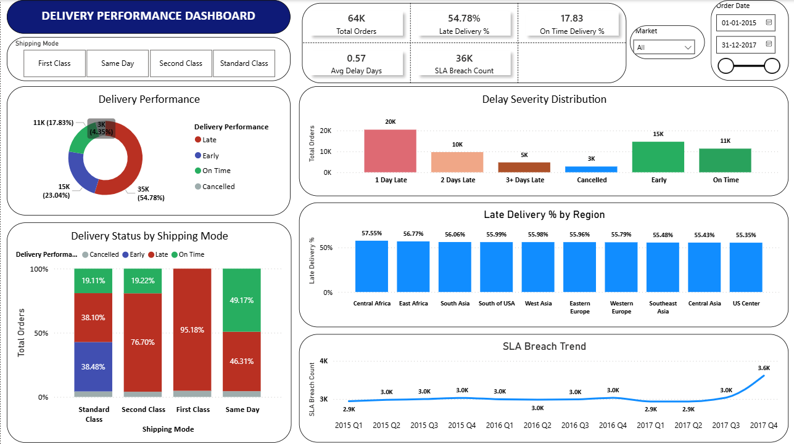
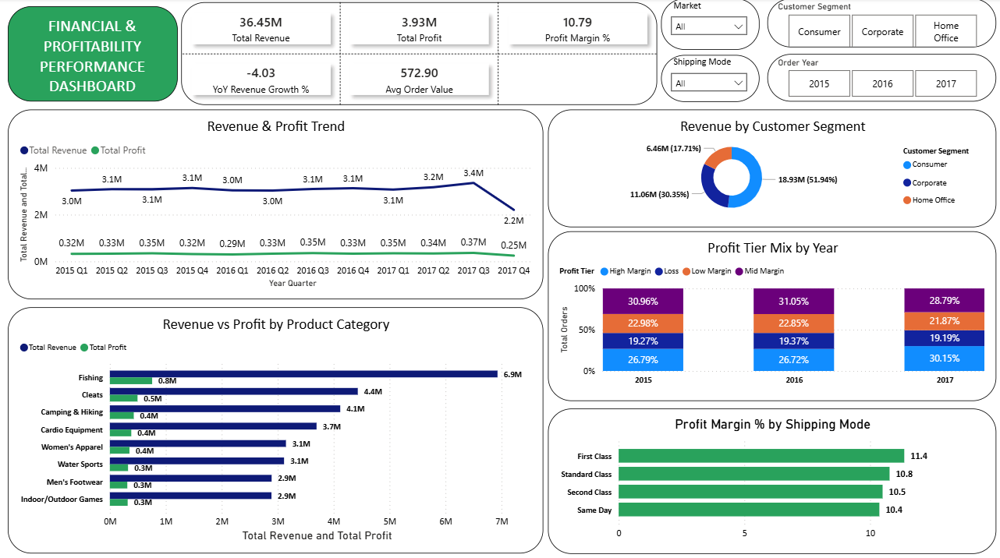
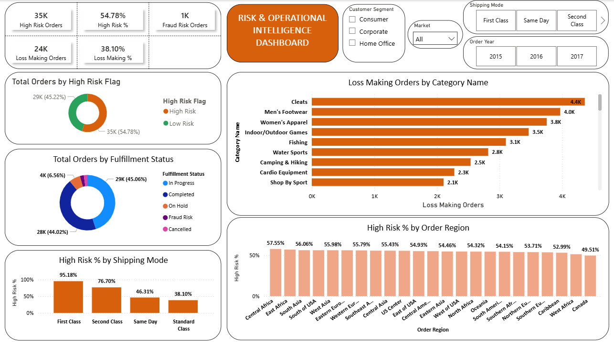

# DataCo Supply Chain Analytics — Power BI Report

## Project Overview
End-to-end Supply Chain Analytics Report built on 180,000+ real orders 
across 5 global markets (2015–2017). The report identifies delivery 
failures, profitability patterns, and operational risk signals across 
3 focused dashboards.

**Tools:** Power BI Desktop · DAX · Power Query · M Language  
**Dataset:** DataCo Smart Supply Chain — [Kaggle Source](https://www.kaggle.com/datasets/shashwatwork/dataco-smart-supply-chain-for-big-data-analysis)  
**Author:** Shashank Bajpai · [LinkedIn](https://linkedin.com/in/shashank-bajpai-53871222a) · [GitHub](https://github.com/Shashank552-dotcom)

---

## Business Problem
A global supply chain operation running across 5 markets with no 
centralized view of delivery performance, margin health, or operational 
risk. This report answers three core questions:
- Where and why are orders failing SLA?
- Which categories and shipping modes are eroding profit margin?
- Where is delivery risk and financial loss concentrated?

---

## Dashboard Pages

### 1. Delivery Performance Dashboard

**Key Findings:**
- 54.78% of 63,629 orders were delivered late
- First Class shipping had a 95% late delivery rate — worst performing mode
- Central Africa ranked as the highest-risk region at 57.55% late delivery
- SLA breaches remained consistently high at ~3K per quarter across 3 years

---

### 2. Financial & Profitability Performance Dashboard

**Key Findings:**
- $36.45M total revenue · $3.93M total profit · 10.79% profit margin
- Fishing was the highest revenue category at $6.9M
- High Margin orders declined from 30.96% (2015) to 28.79% (2017)
- First Class shipping delivered the highest profit margin at 11.4%

---

### 3. Risk & Operational Intelligence Dashboard

**Key Findings:**
- 54.78% of orders flagged as high delivery risk
- Cleats had the highest loss-making orders at 4,400+
- 1,447 orders flagged as suspected fraud
- 38.10% of all orders were loss-making across the 3-year period

---

## Technical Details

### DAX Calculated Columns
| Column | Purpose |
|--------|---------|
| Delay Days | Real shipping days minus scheduled days |
| Delivery Performance | Clean 4-category delivery status label |
| Delay Severity | Bucketed delay magnitude (1 day / 2 days / 3+) |
| Fulfillment Status | Simplified order status (9 raw → 5 clean buckets) |
| Profit Tier | Order profitability segmentation |
| High Risk Flag | Binary delivery risk classification |
| Year Quarter | Clean YYYY QN label for trend charts |
| Order Year | Extracted year for time-based filtering |

### Key DAX Measures
- Late Delivery % · On Time Delivery % · SLA Breach Count
- Total Revenue · Total Profit · Profit Margin %
- YoY Revenue Growth % · Avg Order Value
- High Risk % · Loss Making % · Fraud Risk Orders

---

## Dataset
- **Source:** DataCo Smart Supply Chain Dataset (Kaggle)
- **Rows:** 180,519 orders
- **Columns:** 53 features
- **Period:** January 2015 – December 2017
- **Markets:** Pacific Asia · USCA · Europe · LATAM · Africa

> The raw dataset is not included in this repository due to file size.  
> Download directly from Kaggle using the link above.

---

## How to Use
1. Download the `.pbix` file from this repository
2. Open in **Power BI Desktop** (free download from Microsoft)
3. The data is embedded — no additional setup needed
4. Use slicers to filter by Market, Shipping Mode, Year, and Customer Segment
